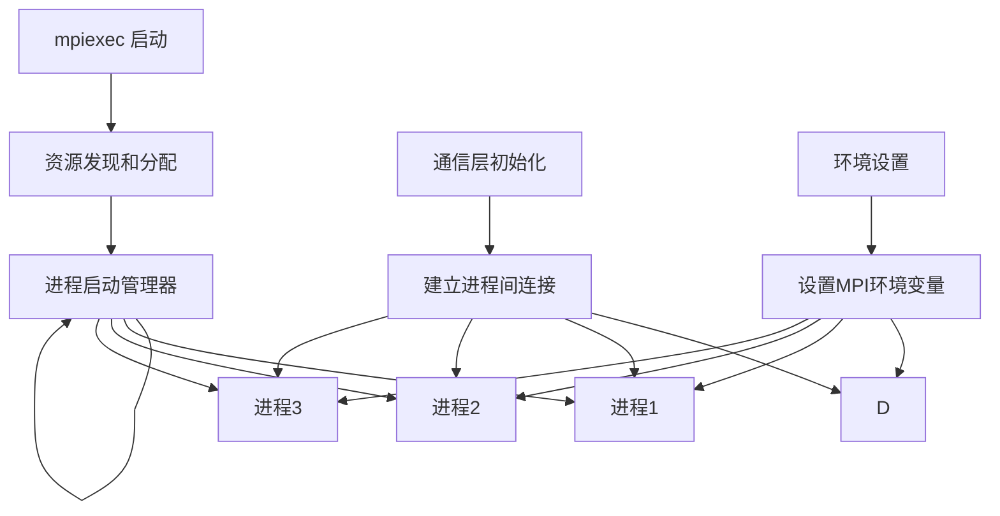
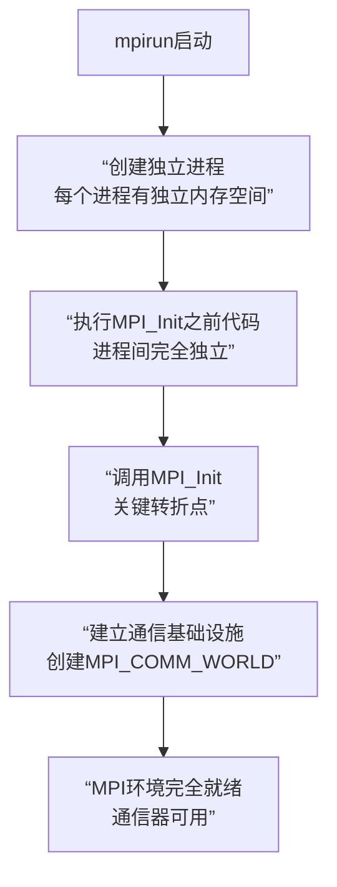
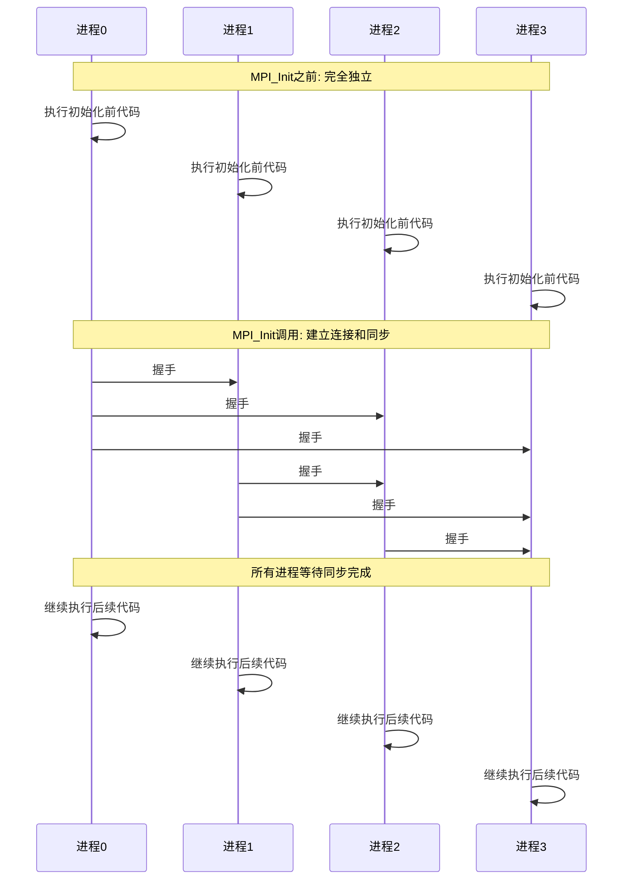

最近要写mpi代码, 于是学习一些基本的mpi

## 学习资源

- [mpi tutorial](https://mpitutorial.com/tutorials/) 这个是一些非常具体的例子, 来自于一个博客. 在初期理解上帮助很大. 除此之外, 作者也列出了很多参考书. 不过不幸的是参考书/教材很多都是拿fortran写的, 所以依托...
- youtube上有很多好的视频.

## 基本通信概念与构建原理

### mpi是一种进程间通信协议

首先，为什么使用进程这种程度的抽象，而不是thread，因为进程是程序运行的最小的完备抽象。进程为程序提供了独立的内存抽象（虚拟地址空间）以及执行资源（cgroups）等，因此需要显式通信的程序最基本的层次就是进程。

mpi定义了一些标准的api和协议，用于进程间相互通信。

对于一个mpi程序，其启动方式通常为mpirun/mpiexec。mpirun将会启动守护进程，并通过守护进程启动（fork出）用户定义数量的进程，并为每个进程提供合适的环境变量。



在mpirun启动程序后，这些进程的表现是独立的，在第一次调用mpi init函数后，守护进程负责创建mpi通信器，它记录了所有进程间的进程号和id的映射关系。守护进程通过通信器对所有管理的进程两两握手。也就是mpi init是一次同步操作。





在通讯组的工作完成后，需要调用mpi finalize注销通信器，清理无关变量，然后所有进程理应销毁。

对于一个mpi程序而言，它遵守的是spmd编程范式，也就是说所有程序都相同，只能通过自身rank来判断执行何种指令。

对于一个程序而言，其通信拓扑可以任意复杂。mpi协议允许在一个程序内创建多个通讯器，从而达到对分工协作的目的。然而每次创建通信器都有可能触发一次同步操作，在每个通信组中，进程的rank是完全独立的，这些rank就是同步的结果。新的通信器将为管理的进程赋予独立的从0开始的rank编号。

## 基本mpi概念

对于进程相互通信，最基本的操作就是发送和接收。

对于发送和接受消息，都需要buffer，它充当寄信和守信的信箱，而mpi通讯器就是邮递员。这块buffer完全就是普通的内存，既可以是栈上的也可以是堆上的。

调用mpi send/recv，通信器将会监控和管理buffer，完成对buffer内数据的读写。

mpi除了最基本的同步send/recv，还提供了异步的操作，合适的使用可以隐藏延迟。

除此外，还有一些通用的全局操作，包括bcast，all gather， all reduce等，实现了高性能的全局通信。

## 动态进程管理

动态进程管理的意思是允许主进程在运行过程中根据实时负载动态的创建新的进程

```cpp
int MPI_Comm_spawn(
    const char *command,      // 子程序可执行文件名
    char *argv[],             // 子程序参数（通常用 MPI_ARGV_NULL）
    int maxprocs,             // 要启动的子进程数
    MPI_Info info,            // 额外信息（可用 MPI_INFO_NULL）
    int root,                 // 在父通信器中的根进程
    MPI_Comm comm,            // 父进程的通信器（通常是 MPI_COMM_WORLD）
    MPI_Comm *intercomm,      // 输出：父子进程间的 inter-communicator
    int array_of_errcodes[]   // 每个子进程的返回码
);
```
spawn操作是父进程通信器组协作进行的, 尽管可以指定root进程, 但是这一般是为了spmd编程下
防止所有进程都重复创建进程. 所以spawn创建的子进程组对该父通信器都是可见的, 创建的新的
`intercomm`非常的特殊, 它的发送接收端是不同的. 正常来说发送和接收端的rank空间是一致的, 但是
`intercomm`这个通信其的两端rank空间分别是父和子. 用这个通信其发送信息默认发送给另一个进程组.

如果希望创建多个进程组, 可以先做`split`, 然后用两个通信器分别spawn即可.只不过这两个子通信器互相不可见.

一个小例子
```cpp
// parent.cpp
#include <mpi.h>
#include <iostream>
#include <string>
#include <thread>   // 用于模拟其他工作
#include <chrono>   // 用于模拟延迟

int main(int argc, char** argv) {

    using message = std::string;

    MPI_Init(&argc, &argv);

    int size, rank;
    MPI_Comm_size(MPI_COMM_WORLD, &size);
    MPI_Comm_rank(MPI_COMM_WORLD, &rank);

    std::cout << "Parent process rank " << rank << " of " << size << " is running." << std::endl;

    MPI_Comm child_comm;
    int child_size = 2;
    int error_codes[child_size];

    // 创建子进程
    MPI_Comm_spawn(
        "./child.x",
        MPI_ARGV_NULL, child_size, MPI_INFO_NULL, 0, MPI_COMM_WORLD,
        &child_comm, error_codes);

    if (rank == 0) {
        message msg = "Hello from parent process! 0";
        MPI_Send(msg.c_str(), msg.size() + 1, MPI_CHAR, 0, 0, child_comm);
        std::cout << "Parent sent message to child: " << msg << std::endl;
    }

    if (rank == 0) {
        // 创建仅0进程可见的子进程池

        MPI_Comm child_comm_0;
        int error_codes_0[1];
        MPI_Comm_spawn(
            "./child.x",
            MPI_ARGV_NULL, 1, MPI_INFO_NULL, 0, MPI_COMM_SELF,
            &child_comm_0, error_codes_0);
        message msg0 = "Hello from parent process! 0 (self)";
        MPI_Send(msg0.c_str(), msg0.size() + 1, MPI_CHAR, 0, 0, child_comm_0);
        std::cout << "Parent sent message to child (self): " << msg0 << std::endl;
    }

    
    MPI_Finalize();
    return 0;
}
```

```cpp
// children.cpp
#include <mpi.h>
#include <iostream>
#include <string>
#include <thread>   // 用于模拟其他工作
#include <chrono>   // 用于模拟延迟

int main(int argc, char** argv) {

    using message = std::string;

    MPI_Init(&argc, &argv);

    int size, rank;
    MPI_Comm_size(MPI_COMM_WORLD, &size);
    MPI_Comm_rank(MPI_COMM_WORLD, &rank);

    std::cout << "Child process rank " << rank << " of " << size << " is running." << std::endl;

    MPI_Comm parent_comm;
    MPI_Comm_get_parent(&parent_comm);

    if (parent_comm == MPI_COMM_NULL) {
        std::cerr << "No parent communicator. Exiting." << std::endl;
        MPI_Finalize();
        return -1;
    }

    if (rank == 0) {
        const int buffer_size = 100;
        char buffer[buffer_size];
        MPI_Recv(buffer, buffer_size, MPI_CHAR, 0, 0, parent_comm, MPI_STATUS_IGNORE);
        message msg(buffer);
        std::cout << "Child received message from parent: " << msg << std::endl;
    }
    
    MPI_Finalize();
    return 0;
}
```

```bash
mpic++ -o parent.x parent.cpp
mpic++ -o child.x children.cpp
mpirun -np 3 ./parent.x
```

```
Parent process rank 0 of 3 is running.
Parent process rank 1 of 3 is running.
Parent process rank 2 of 3 is running.
Child process rank 1 of 2 is running.
Child process rank 0 of 2 is running.
Parent sent message to child: Hello from parent process! 0
Child received message from parent: Hello from parent process! 0
Parent sent message to child (self): Hello from parent process! 0 (self)
Child process rank 0 of 1 is running.
Child received message from parent: Hello from parent process! 0 (self)
```

## 拓扑

进程拓扑为MPI进程提供结构化的通信关系，让通信模式更贴近问题的几何结构，而不是简单的线性rank排列。

### 笛卡尔拓扑（网格拓扑）：

- 将进程排列成多维网格，每个进程有明确的坐标位置
- 自动计算物理邻居关系（上下左右、前后等方向）
- 支持周期性边界，形成环形连接
- 可以创建行、列等子通信器，在子网格内进行集体操作
- 进程通过坐标而非rank来定位，通信更直观

重要的函数有:

```cpp
int MPI_Dims_create(int nnodes, int ndims, int *dims);
int MPI_Cart_create(MPI_Comm comm_old, int ndims, const int dims[],
    const int periods[], int reorder, MPI_Comm *comm_cart);
int MPI_Cart_coords(MPI_Comm comm, int rank, int maxdims, int coords[]);
int MPI_Cart_rank(MPI_Comm comm, const int coords[], int *rank);

// 计算在指定方向上移动disp步后的源和目标进程rank, rank_source表示从哪里接收数据,
// rank_dest表示发送到哪里
int MPI_Cart_shift(MPI_Comm comm, int direction, int disp,
    int *rank_source, int *rank_dest);

// 除此之外还可以创建子通信器
int MPI_Cart_sub(MPI_Comm comm, const int remain_dims[], MPI_Comm *comm_sub);
```

### 图拓扑：

- 定义任意的进程连接关系，适用于不规则通信模式
- 每个进程有特定的邻居集合，不要求规则的几何结构
- 适合建模复杂的依赖关系，如稀疏矩阵计算、图算法

### 笛卡尔积拓扑的例子

一个好玩的例子是二维粒子随机游走

```cpp
// randomwalk2d.h
#ifndef RANDOMWALK2D_H
#define RANDOMWALK2D_H

#include <vector>

namespace RandomWalk2D {

enum Direction {
    LEFT = 0,
    RIGHT = 1,
    DOWN = 2,
    UP = 3
};

template<int D>
class Point {
private:
    int coords[D];
public:
    Point() {
        for (int i = 0; i < D; ++i) coords[i] = 0;
    }
    Point(int* initial_coords) {
        for (int i = 0; i < D; ++i) coords[i] = initial_coords[i];
    }

    int& operator[](int index) { return coords[index]; }
    const int& operator[](int index) const { return coords[index]; }
};

} // namespace RandomWalk2D

#endif // RANDOMWALK2D_H
```

```cpp
// randomwalk2d.cpp
// randomwalk2d.cpp
#include <mpi.h>
#include <iostream>
#include <vector>
#include <cstdlib>
#include <ctime>
#include "randomwalk2d.h"

using namespace RandomWalk2D;

int main(int argc, char** argv) {
    MPI_Init(&argc, &argv);

    using Point2D = Point<2>;
    using vecP = std::vector<Point2D>;

    int rank, size;
    MPI_Comm_rank(MPI_COMM_WORLD, &rank);
    MPI_Comm_size(MPI_COMM_WORLD, &size);

    // 随机游走参数
    int max_steps = 1000;
    int num_particles = 10;
    if (argc > 1) max_steps = std::atoi(argv[1]);

    // 创建 2D 笛卡尔拓扑
    int dims[2] = {0,0};
    MPI_Dims_create(size, 2, dims);
    int periods[2] = {1, 1}; // wrap-around
    MPI_Comm cart_comm;
    MPI_Cart_create(MPI_COMM_WORLD, 2, dims, periods, 1, &cart_comm);

    int coords[2];
    MPI_Cart_coords(cart_comm, rank, 2, coords);

    int neighbors[4]; // LEFT, RIGHT, DOWN, UP
    MPI_Cart_shift(cart_comm, 0, 1, &neighbors[LEFT], &neighbors[RIGHT]);
    MPI_Cart_shift(cart_comm, 1, 1, &neighbors[DOWN], &neighbors[UP]);

    // 局部子网格大小 (假设全局 Nx x Ny = 20x20)
    const int Nx = 20, Ny = 20;
    int local_nx = Nx / dims[0];
    int local_ny = Ny / dims[1];

    // std::cout << "Rank " << rank << " coords (" << coords[0] << "," << coords[1] 
    //           << ") neighbors L:" << neighbors[LEFT] << " R:" << neighbors[RIGHT]
    //           << " D:" << neighbors[DOWN] << " U:" << neighbors[UP] << std::endl;
    // std::cout << "Rank " << rank << " local grid size: " << local_nx << " x " << local_ny << std::endl;

    // 初始化粒子
    vecP my_particles;
    std::srand(static_cast<unsigned int>(std::time(0)) + rank);
    for (int i = 0; i < num_particles; ++i) {
        int x = std::rand() % local_nx;
        int y = std::rand() % local_ny;
        int init[2] = {x, y};
        my_particles.emplace_back(init);
    }

    // 随机游走主循环
    for (int step = 0; step < max_steps; ++step) {
        vecP send_buffers[4]; // LEFT, RIGHT, DOWN, UP
        vecP new_particles;

        // 更新粒子位置
        for (auto &p : my_particles) {
            int dir = std::rand() % 4;
            switch(dir){
                case LEFT:  p[0] -= 1; break;
                case RIGHT: p[0] += 1; break;
                case DOWN:  p[1] -= 1; break;
                case UP:    p[1] += 1; break;
            }

            if (p[0] < 0) { p[0] += local_nx; send_buffers[LEFT].push_back(p); }
            else if (p[0] >= local_nx) { p[0] -= local_nx; send_buffers[RIGHT].push_back(p); }
            else if (p[1] < 0) { p[1] += local_ny; send_buffers[DOWN].push_back(p); }
            else if (p[1] >= local_ny) { p[1] -= local_ny; send_buffers[UP].push_back(p); }
            else new_particles.push_back(p);
        }
        my_particles.swap(new_particles);


        // 交换粒子数量
        int counts_send[4] = {
            static_cast<int>(send_buffers[LEFT].size()),
            static_cast<int>(send_buffers[RIGHT].size()),
            static_cast<int>(send_buffers[DOWN].size()),
            static_cast<int>(send_buffers[UP].size())
        };
        int counts_recv[4];

        MPI_Request reqs[8];
        int k = 0;
        MPI_Isend(&counts_send[LEFT], 1, MPI_INT, neighbors[LEFT], 0, cart_comm, &reqs[k++]);
        MPI_Isend(&counts_send[RIGHT],1, MPI_INT, neighbors[RIGHT],0, cart_comm, &reqs[k++]);
        MPI_Isend(&counts_send[DOWN], 1, MPI_INT, neighbors[DOWN],0, cart_comm, &reqs[k++]);
        MPI_Isend(&counts_send[UP],   1, MPI_INT, neighbors[UP],  0, cart_comm, &reqs[k++]);
        MPI_Irecv(&counts_recv[LEFT],  1, MPI_INT, neighbors[LEFT], 0, cart_comm, &reqs[k++]);
        MPI_Irecv(&counts_recv[RIGHT], 1, MPI_INT, neighbors[RIGHT],0, cart_comm, &reqs[k++]);
        MPI_Irecv(&counts_recv[DOWN],  1, MPI_INT, neighbors[DOWN], 0, cart_comm, &reqs[k++]);
        MPI_Irecv(&counts_recv[UP],    1, MPI_INT, neighbors[UP],   0, cart_comm, &reqs[k++]);
        MPI_Waitall(8, reqs, MPI_STATUSES_IGNORE);

        // 接收缓冲区
        vecP recv_buffers[4];
        for(int d=0; d<4; ++d)
            recv_buffers[d].resize(counts_recv[d]);

        // 发送/接收粒子
        k = 0;
        MPI_Isend(send_buffers[LEFT].data(),  counts_send[LEFT]*sizeof(Point2D), MPI_BYTE, neighbors[LEFT], 1, cart_comm, &reqs[k++]);
        MPI_Isend(send_buffers[RIGHT].data(), counts_send[RIGHT]*sizeof(Point2D),MPI_BYTE, neighbors[RIGHT],1, cart_comm, &reqs[k++]);
        MPI_Isend(send_buffers[DOWN].data(),  counts_send[DOWN]*sizeof(Point2D), MPI_BYTE, neighbors[DOWN],1, cart_comm, &reqs[k++]);
        MPI_Isend(send_buffers[UP].data(),    counts_send[UP]*sizeof(Point2D),   MPI_BYTE, neighbors[UP],  1, cart_comm, &reqs[k++]);
        MPI_Irecv(recv_buffers[LEFT].data(),  counts_recv[LEFT]*sizeof(Point2D),  MPI_BYTE, neighbors[LEFT], 1, cart_comm, &reqs[k++]);
        MPI_Irecv(recv_buffers[RIGHT].data(), counts_recv[RIGHT]*sizeof(Point2D), MPI_BYTE, neighbors[RIGHT],1, cart_comm, &reqs[k++]);
        MPI_Irecv(recv_buffers[DOWN].data(),  counts_recv[DOWN]*sizeof(Point2D),  MPI_BYTE, neighbors[DOWN], 1, cart_comm, &reqs[k++]);
        MPI_Irecv(recv_buffers[UP].data(),    counts_recv[UP]*sizeof(Point2D),    MPI_BYTE, neighbors[UP],   1, cart_comm, &reqs[k++]);
        MPI_Waitall(8, reqs, MPI_STATUSES_IGNORE);

        // 合并收到的粒子
        for(int d=0; d<4; ++d)
            my_particles.insert(my_particles.end(), recv_buffers[d].begin(), recv_buffers[d].end());
    }

    // 输出每个 rank 粒子数
    std::cout << "Rank " << rank << " final particle count: " << my_particles.size() << std::endl;

    MPI_Finalize();
    return 0;
}
```

## 端口连接

mpi支持启动程序后动态连接到已经运行的mpi程序上.

```cpp
#include <mpi.h>
#include <iostream>

int main() {
    MPI_Init(NULL, NULL);

    char port_name[MPI_MAX_PORT_NAME];

    // 打开端口
    MPI_Open_port(MPI_INFO_NULL, port_name);
    std::cout << "Server port: " << port_name << std::endl;

    MPI_Comm inter_comm;
    // 等待客户端连接
    MPI_Comm_accept(port_name, MPI_INFO_NULL, 0, MPI_COMM_WORLD, &inter_comm);

    int msg = 123;
    MPI_Send(&msg, 1, MPI_INT, 0, 0, inter_comm); // 发送一个简单消息

    MPI_Close_port(port_name);
    MPI_Finalize();
    return 0;
}
```

```cpp
#include <mpi.h>
#include <iostream>

int main() {
    MPI_Init(NULL, NULL);

    char port_name[MPI_MAX_PORT_NAME];
    std::cout << "Enter server port name: ";
    std::cin >> port_name;

    MPI_Comm inter_comm;
    // 连接服务端
    MPI_Comm_connect(port_name, MPI_INFO_NULL, 0, MPI_COMM_WORLD, &inter_comm);

    int msg;
    MPI_Recv(&msg, 1, MPI_INT, 0, 0, inter_comm, MPI_STATUS_IGNORE);
    std::cout << "Client received: " << msg << std::endl;

    MPI_Finalize();
    return 0;
}
```

```bash
mpirun -np 1 ./server.x
# Server port: tag#0$connentry#6C6F67696E4E6F6465000200B231C0A802010000000000000000$

# 在另一个终端运行客户端
mpirun -np 1 ./client.x
# Enter server port name: tag#0$connentry#6C6F67696E4E6F6465000200B231C0A802010000000000000000$
# Client received: 123
```

## 单边通信

单边通信允许一个进程直接读写另一个进程的内存，而不需要目标进程的显式参与。这种方式可以减少同步开销，提高通信效率。

```cpp
#include <mpi.h>
#include <iostream>

int main(int argc, char** argv) {
    MPI_Init(&argc, &argv);

    int rank;
    MPI_Comm_rank(MPI_COMM_WORLD, &rank);

    int target_data = 0;
    MPI_Win win;

    // 创建窗口
    MPI_Win_create(&target_data, sizeof(int), sizeof(int), MPI_INFO_NULL,
                   MPI_COMM_WORLD, &win);

    MPI_Win_fence(0, win); // 同步窗口

    if(rank == 0){
        int value = 42;
        // Put操作：把value写到rank 1的target_data
        MPI_Put(&value, 1, MPI_INT, 1, 0, 1, MPI_INT, win);
    }

    MPI_Win_fence(0, win); // 完成同步

    if(rank == 1){
        std::cout << "Rank 1 received: " << target_data << std::endl;
    }

    MPI_Win_free(&win);
    MPI_Finalize();
    return 0;
}
```

一个常见的疑惑是为什么进程0也要创建窗口, 这是因为mpi的单边通信要求所有进程都要创建窗口. 否则进程0实际上不知道进程1的窗口是否存在. 也就是创建窗口本质上也是一次全局同步操作.

1. MPI 单边通信要求集体调用

- MPI_Win_create 是 通信器内的集体调用，通信器内的每个进程都必须参与。

- 这保证了每个进程都有一个本地窗口对象句柄，MPI 内部可以形成全局一致的 RMA 语义。

2. 为什么进程 0 也必须创建窗口

- 即使进程 0 只是发送（Put）数据，也需要参与窗口创建。

- 原因：进程 0 并不知道目标进程的窗口是否已经创建，如果它自己不参与，MPI 无法保证远程访问的合法性和一致性。

- 所以窗口创建本质上也具有一次 **全局同步** 的语义，确保所有进程都对窗口的存在和布局达成一致。

3. 优化做法

- 如果发送端不需要被访问，可以创建 大小为 0 的窗口，满足集体调用要求，同时不暴露内存。