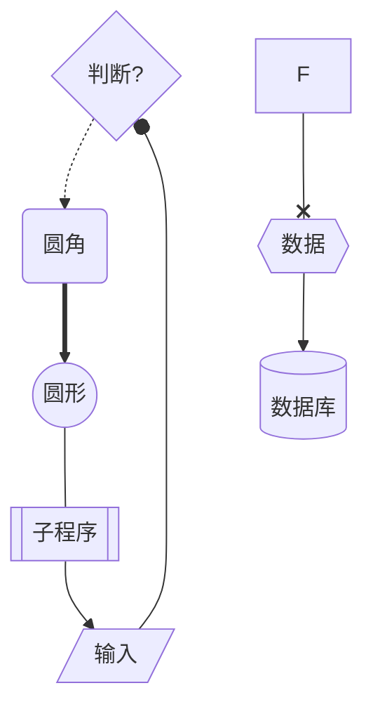
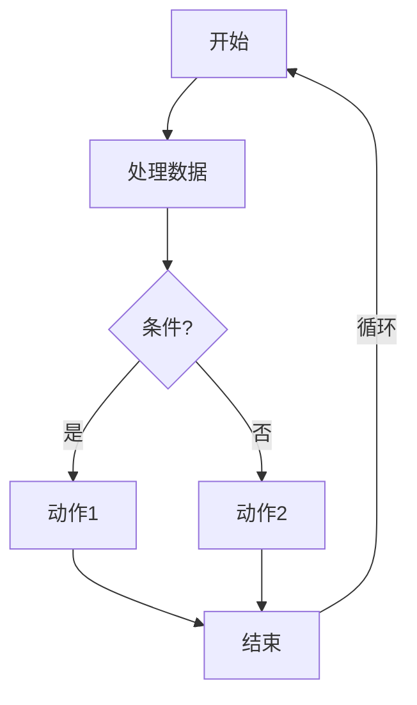
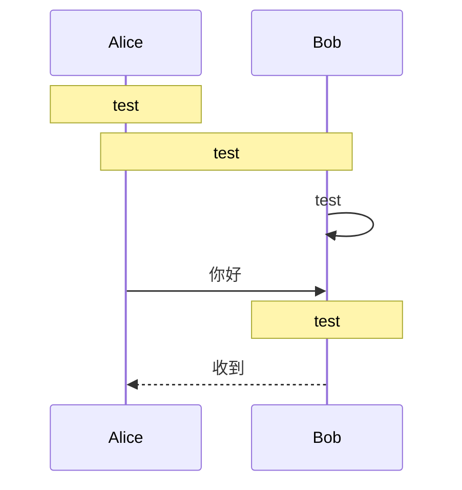
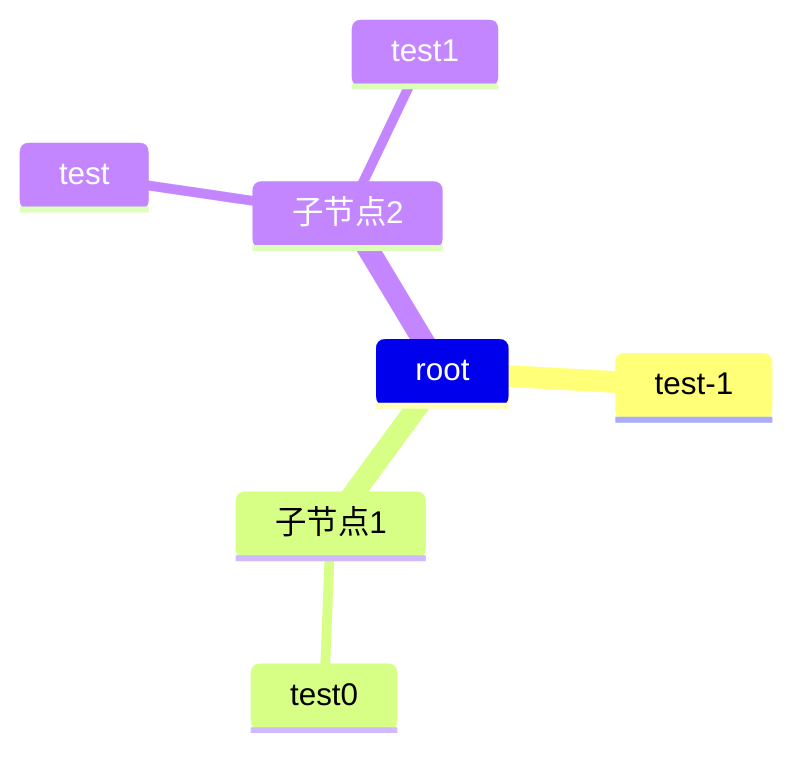
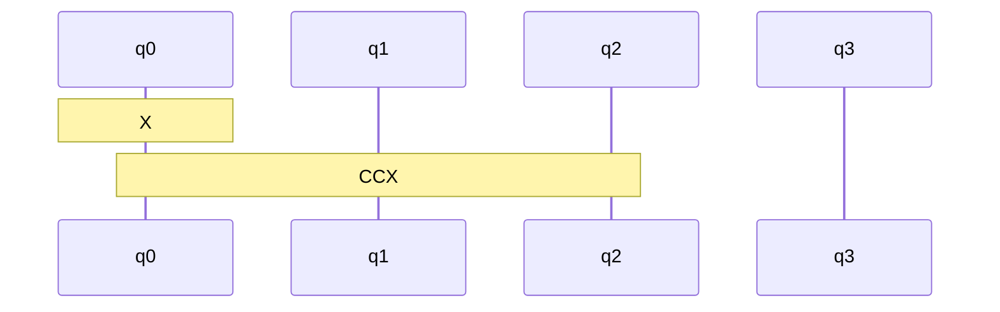

在用ai写文档的时候发现它会生成一些非常好看的图, 值得仔细研究一下.

但是主页好像渲染不了, 必须在vscode里下载mermaid插件才行.

## render test
<div class="mermaid">
graph TD
    A --> B
</div>


## 流程图

基本语法是

```
obj[descriptor] --> |arrow descriptor| obj[description]
```
其中mermaid提供了不同的样式







## 流程图


## 甘特图


## 状态


## 树


## circuit

好像用sequence没办法画circuit, 因为没办法指向用来做gate的note框

