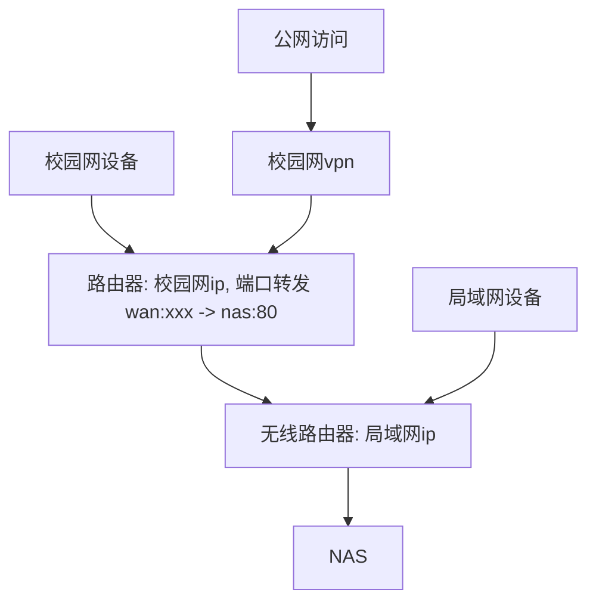

最近折腾了一台 NAS, 用了一台垃圾机器做主机, 已经服务器换下来的硬盘, 记录一下配置过程.

---

## 硬件配置:
- 主机: 华为 OrangePi Aipro, 4 核, 16GB 内存
- 硬盘: 16T x 1.

--- 

## 网络拓扑

## 软件配置

* NAS系统: openEuler + mysql + php-fpm + nginx + nextcloud
* 软路由: openWRT

## 安装过程

1. 首先直接 `yum install mysqld, php-fpm, nginx` 等等
2. 放开80端口, 设置开机自启动, 设置目录权限, 注意nginx要和php-fpm配合好, 有时候两者用户名不同, 修改nginx配置文件中的 `user` 字段.
3. 初始化 `mysql`, 设置 root 密码, 创建 nextcloud 数据库和用户. 将`mysql`设置为开机自启动. 修改对应目录权限为 `mysql:mysql`.
4. 下载 nextcloud, 解压到 `/usr/share/nginx/nextcloud`, 修改目录权限使得nginx和php-fpm可以访问.
5. 配置 nginx, 直接让ai写一个就行, 记得listen 80端口, root 指向 nextcloud 目录.
6. 配置 nextcloud 的 `config.php`, 大部分可以在网页端配置, 但是如果要走端口映射需要手动在config.php中添加路由器的ip. 除此之外, 默认localhost访问, 建议改成127.0.0.1, port 80, 走 TCP.
7. 访问 nas 的ip, 完成 nextcloud 的安装向导.

## 结果

由于这个主机太垃圾, 配置好再重启直接挂了... 再也开不了机.

Update: 感觉是电源的问题，现在又恢复了笑死

## zotero 配置webdav同步

zotero这个论文管理软件的官方是有自带的云盘的但是套餐巨贵， 所以恰好自己有nas，并且zotero支持webdav存储协议， 于是自己配置了一下

[official document](https://docs.nextcloud.com/server/28/user_manual/en/files/access_webdav.html)

