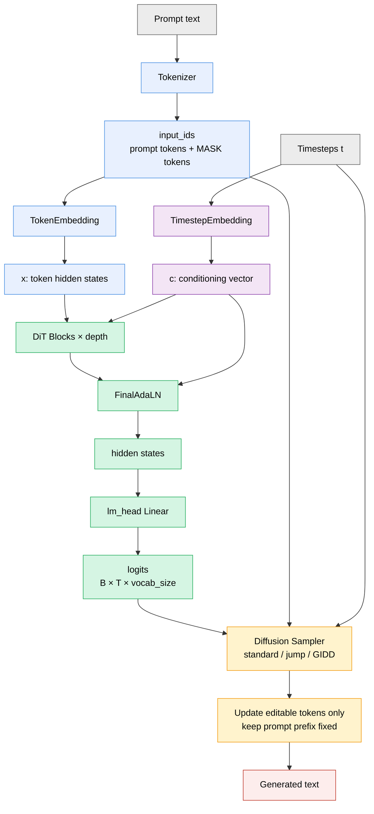
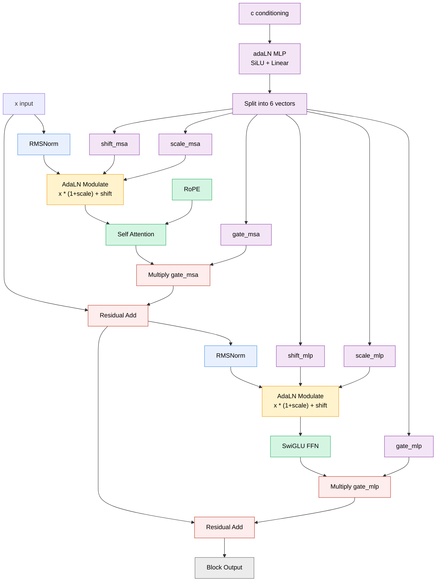
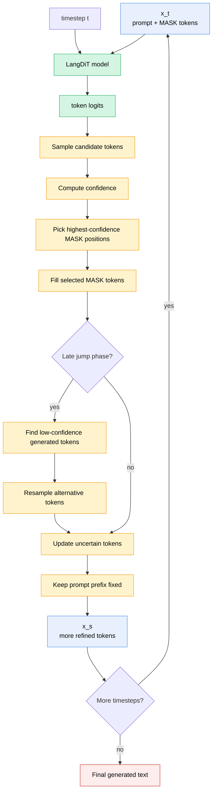
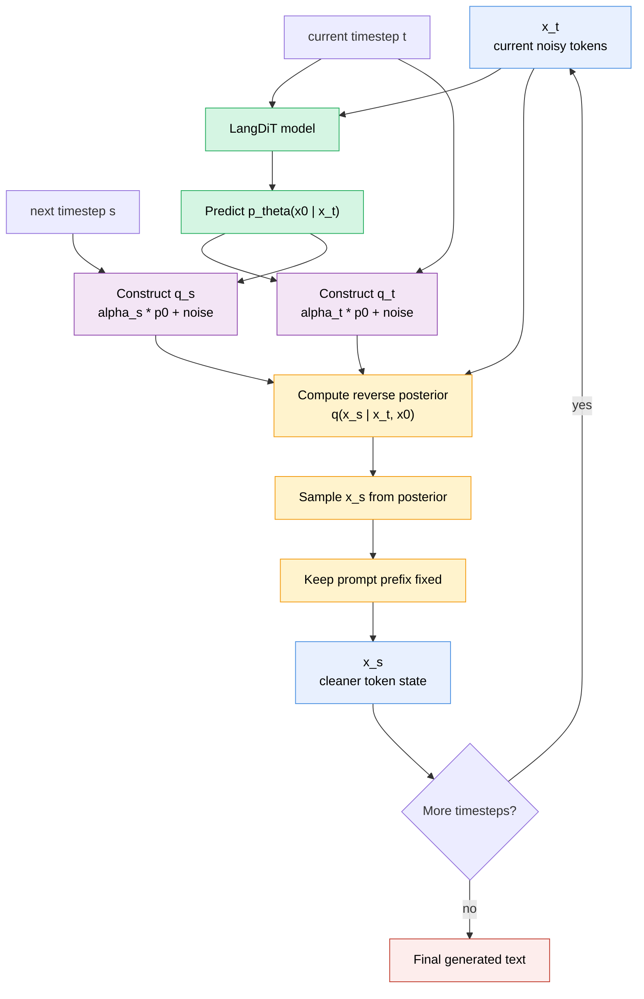

去了一家初创大模型公司面试。他们发了一个[开源的小模型](https://github.com/whaletech-ai/W1-4B-dLLM-Base)，看看他们使用的架构是什么样子的。（本来想继续面的可惜已经找到了满意的地方就决定不继续了。。。

## 基本架构

首先架构核心采用的是经典的transformer DIT做序列建模。整个架构的流程大概是：

### Main



### DIT block


### config

```yaml
model:
  vocab_size: 64512
  hidden_size: 2048
  attn_dim: 3072
  ffn_dim: 7168
  depth: 48
  num_heads: 24
  head_dim: 128
  max_seq_len: 4096
  timestep_freq_dim: 256
  rope_theta: 10000.0
  cond_dim: 256
  dropout: 0.0
  attn_dropout: 0.0

diffusion:
  mask_token_id: 14
```

## 采样

模型使用了两种方式进行生成，一种是启发式的，每次从$x_t$进入模型得到$x_0$,固定最高置信度的部分token，迭代生成；另一种就是使用GIDD，真正的离散扩散采样。

### Jump



### GIDD

