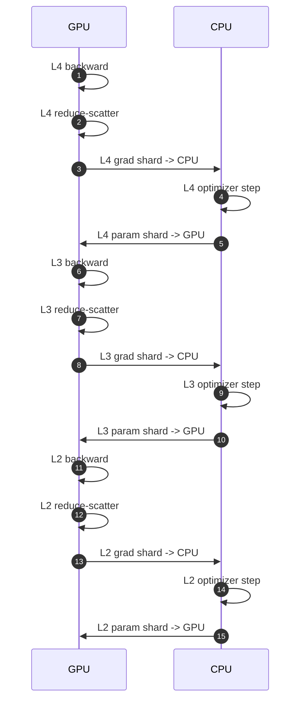

大模型分布式训练中, ZeRO (Zero Redundancy Optimizer) 系列论文提出了一系列创新的方法来优化内存使用和计算效率. 它是在没有Pipeline并行的情况下, 通过分布式存储和计算来实现大规模模型训练的关键技术. 下面是对 ZeRO 系列论文的学习总结.

---

## ZeRO: Memory Optimizations Toward Training Trillion  Parameter Models

### where did all the memory go?

- parameters
- gradients
- optimizer states
- activations
- temporary buffers

example: Adam. Adam需要存储参数, 两个动量项(一阶和二阶), 以及梯度. 这意味着每个参数需要4倍的内存.

#### Trick1: mixed precision training

| 内容                  | 用 FP16/FP32 |
| ------------------- | ----------- |
| forward/backward 权重 | FP16        |
| 激活                  | FP16        |
| 梯度累积                | FP32        |
| optimizer 状态（m/v）   | FP32        |
| master weight 副本    | FP32        |

Mixed precision training of a model with Ψ parameters using Adam requires enough memory to hold an f p16 copy of the parameters and the gradients, with memory requirements of 2Ψ and 2Ψ bytes respectively. In addition, it needs to hold the optimizer states: an f p32 copy of the parameters, momentum and variance, with memory requirements of 4Ψ, 4Ψ, and 4Ψ bytes, respectively.

Let’s use K to denote the memory multiplier of the optimizer states, i.e., the additional memory required to store them is KΨ bytes. Mixed-precision Adam has K = 12. In total, this results in 2Ψ + 2Ψ + KΨ = 16Ψ bytes of memory requirement. For a model such as GPT-2 with 1.5 Billion parameters, this leads to a memory requirement of at least 24 GB, which is significantly higher than the meager 3 GB of memory required to hold the f p16 parameters alone.

#### Residual memory

* 对 Transformer/GPT 这种模型来说：

  * 每一层都有 hidden states：`hidden_states[layer] = seq_len × hidden_dim × batch_size × dtype`
  * forward 计算时，需要 **保留所有层的 hidden states** 以便 backward 计算梯度
  * Attention 还需要保存 **key/value cache**
* **公式示意**：
   $$
  \text{activation mem} \approx batch_size \times seq_len \times hidden_dim \times num_layers \times sizeof(dtype)
  $$

* 因为 batch size × seq_len × num_layers 可能非常大，所以 activation 内存远远超过参数量（尤其是 FP16，参数量较小）

**example:**

* GPT-2 1.5B 参数

  * seq_len = 1K, batch size = 32 → activation 内存 ≈ 60 GB
  * 说明 activation 占用几乎是参数的几十倍

---

** Activation Checkpointing（重计算）**

* **核心思想**：

  * **不保存每层 activation**，只保存少量“checkpoint”节点
  * backward 时，如果某些 activation 不存在，就 **重新计算 forward** 来得到它

* **显存效果**：

  * activation 内存大约减小到 **√(总 activations)**
  * 对 GPT-2 1.5B：

    * 原始 activation ≈ 60 GB
    * checkpoint 后 ≈ 8 GB

* **代价**：

  * 约 **33% 的额外计算**（因为部分 forward 被重复计算）

---

** 大模型仍然显存爆炸**

* 对 100B 参数 GPT-like 模型：

  * batch size 32，即便用 activation checkpointing → activation 仍然需要 ~60 GB
  * 原因：

    1. 参数太多 → hidden_dim / layer 数量极大
    2. batch size 和 seq_len 大 → 激活数量巨增
* 所以 **activation 仍然是显存瓶颈**，甚至比参数和 optimizer 状态更严重

---

### zero 框架和 TP 的区别

当我们看到分布式存储参数的时候就必须提问， 它和张量并行有什么区别

本质上来说，zero还停留在了DP， 没有进行模型的切分， 每个卡的激活值都是不相关的， 相当于在batch维度做了并行。
在单卡batch固定的时候，它不能改变单一gpu中模型权重和激活值占用现存的比例。

而TP是在隐藏维度把模型切开了，它真正的节省了激活值占用的内存， 也就是单卡batch固定的时候，激活值被分配到了多张卡。

DP尽管并行效率非常高，但是问题在于它会导致global batch上升，这有可能导致训练的收敛性变差

而MP/TP则不会出现这个问题， 比如DP中单卡batch32， 用8卡， 相当于batch 256， 但是可以4 DP x 2 TP， 这样是batch 128，
节约了单卡激活值占用的内存， 而没有减少单卡的batch大小， 允许更大的隐藏层维度

当不考虑batch产生的影响的时候， DP一般来说是优于TP的。

## ZeRO-Offload: Democratizing Billion-Scale Model Training

✅ 把 优化器状态（optimizer states） 移到 CPU
✅ 把 梯度（gradients） 移到 CPU（计算后再 offload）
✅ 在 CPU 上做参数更新（optimizer compute）

### 它的工作流程简化版（DP基础上）

ZeRO-Offload 基于 ZeRO-2 的状态切分思想，但做了更激进的 offload：

1. Backward 计算梯度（GPU）

2. GPU 用 reduce-scatter 聚合梯度

3. 聚合后的梯度 offload 到 CPU

4. CPU 并行更新每个 partition 的 optimizer state

5. 更新后的参数 partition 从 CPU 拷回 GPU

6. GPU 做 all-gather 得到完整参数用于下一次前向

7. 数据移动与计算重叠 以减少性能损失

### 限制 / 性能挑战

- 未解决 activation 内存瓶颈 — activation 仍在 GPU
- Offload 会增加 CPU-GPU 数据传输和 CPU 计算负载
- 对高速 PCIe / CPU 内存性能依赖较强（如果低速可能减速）

### 流水线

整个offload架构流水线有两个组成部分， 分别是cpu端和gpu端，一个阶段可以理解为
模型一个层的计算

具体来说， 可以计算和通信隐藏的有5个：
- gpu layer n backward
- gpu layer n-1 reduce scatter
- gpu layer n-2 copy to cpu
- cpu layer n-3 optimizer update
- cpu layer n-4 back to gpu

> 在 ZeRO-Offload / ZeRO-Infinity 中，可以把 一个层在反向和参数更新生命周期中的若干步骤 看成流水线的不同阶段。
> 在进入稳态之后，在某个时间片上，大致可以同时存在如下 5 类操作（layer 索引只是为了说明“错位”，不是固定设计）：
>
> - GPU：对第 \(l\) 层做 backward 计算
> - GPU：对第 \(l-1\) 层的梯度做 reduce-scatter / all-reduce 等通信
> - GPU→CPU：把第 \(l-2\) 层的梯度或参数分片拷贝到 CPU 的 optimizer 内存
> - CPU：在第 \(l-3\) 层对应的分片上执行 optimizer 更新
> - CPU→GPU：将第 \(l-4\) 层更新后的参数分片拷回 GPU，为后续前向 / 下一轮迭代做准备
>
> 这样，GPU 上的算子计算、分布式通信、CPU 上的优化器计算以及 CPU↔GPU 之间的数据传输就可以在不同层之间交错并行，最大化隐藏 offload 带来的额外开销。

