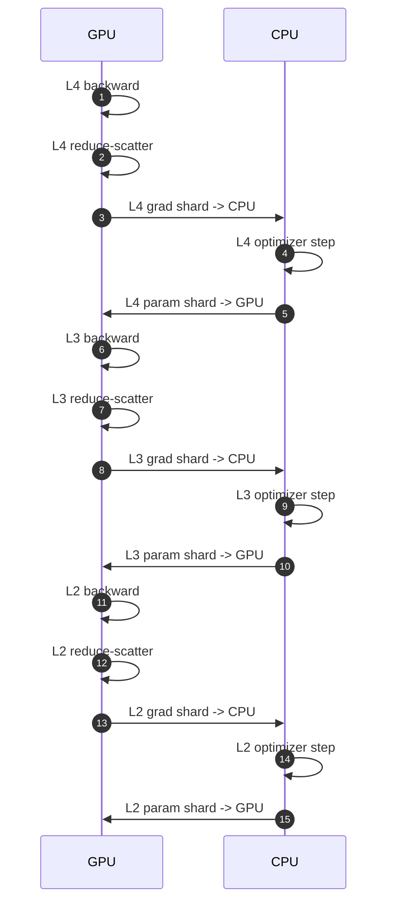

大模型分布式训练中, ZeRO (Zero Redundancy Optimizer) 系列论文提出了一系列创新的方法来优化内存使用和计算效率. 它是在没有Pipeline并行的情况下, 通过分布式存储和计算来实现大规模模型训练的关键技术. 下面是对 ZeRO 系列论文的学习总结.

---

## ZeRO: Memory Optimizations Toward Training Trillion  Parameter Models


### where did all the memory go?

- parameters
- gradients
- optimizer states
- activations
- temporary buffers

example: Adam. Adam需要存储参数, 两个动量项(一阶和二阶), 以及梯度. 这意味着每个参数需要4倍的内存.

#### Trick1: mixed precision training

| 内容                  | 用 FP16/FP32 |
| ------------------- | ----------- |
| forward/backward 权重 | FP16        |
| 激活                  | FP16        |
| 梯度累积                | FP32        |
| optimizer 状态（m/v）   | FP32        |
| master weight 副本    | FP32        |

Mixed precision training of a model with Ψ parameters using Adam requires enough memory to hold an f p16 copy of the parameters and the gradients, with memory requirements of 2Ψ and 2Ψ bytes respectively. In addition, it needs to hold the optimizer states: an f p32 copy of the parameters, momentum and variance, with memory requirements of 4Ψ, 4Ψ, and 4Ψ bytes, respectively.

Let’s use K to denote the memory multiplier of the optimizer states, i.e., the additional memory required to store them is KΨ bytes. Mixed-precision Adam has K = 12. In total, this results in 2Ψ + 2Ψ + KΨ = 16Ψ bytes of memory requirement. For a model such as GPT-2 with 1.5 Billion parameters, this leads to a memory requirement of at least 24 GB, which is significantly higher than the meager 3 GB of memory required to hold the f p16 parameters alone.

#### Residual memory

* 对 Transformer/GPT 这种模型来说：

  * 每一层都有 hidden states：`hidden_states[layer] = seq_len × hidden_dim × batch_size × dtype`
  * forward 计算时，需要 **保留所有层的 hidden states** 以便 backward 计算梯度
  * Attention 还需要保存 **key/value cache**
* **公式示意**：
   $$
  \text{activation mem} \approx batch_size \times seq_len \times hidden_dim \times num_layers \times sizeof(dtype)
  $$

* 因为 batch size × seq_len × num_layers 可能非常大，所以 activation 内存远远超过参数量（尤其是 FP16，参数量较小）

**example:**

* GPT-2 1.5B 参数

  * seq_len = 1K, batch size = 32 → activation 内存 ≈ 60 GB
  * 说明 activation 占用几乎是参数的几十倍

---

** Activation Checkpointing（重计算）**

* **核心思想**：

  * **不保存每层 activation**，只保存少量“checkpoint”节点
  * backward 时，如果某些 activation 不存在，就 **重新计算 forward** 来得到它

* **显存效果**：

  * activation 内存大约减小到 **√(总 activations)**
  * 对 GPT-2 1.5B：

    * 原始 activation ≈ 60 GB
    * checkpoint 后 ≈ 8 GB

* **代价**：

  * 约 **33% 的额外计算**（因为部分 forward 被重复计算）

---

** 大模型仍然显存爆炸**

* 对 100B 参数 GPT-like 模型：

  * batch size 32，即便用 activation checkpointing → activation 仍然需要 ~60 GB
  * 原因：

    1. 参数太多 → hidden_dim / layer 数量极大
    2. batch size 和 seq_len 大 → 激活数量巨增
* 所以 **activation 仍然是显存瓶颈**，甚至比参数和 optimizer 状态更严重

---

### zero 框架和 TP 的区别

当我们看到分布式存储参数的时候就必须提问， 它和张量并行有什么区别

本质上来说，zero还停留在了DP， 没有进行模型的切分， 每个卡的激活值都是不相关的， 相当于在batch维度做了并行。
在单卡batch固定的时候，它不能改变单一gpu中模型权重和激活值占用现存的比例。

而TP是在隐藏维度把模型切开了，它真正的节省了激活值占用的内存， 也就是单卡batch固定的时候，激活值被分配到了多张卡。

DP尽管并行效率非常高，但是问题在于它会导致global batch上升，这有可能导致训练的收敛性变差

而MP/TP则不会出现这个问题， 比如DP中单卡batch32， 用8卡， 相当于batch 256， 但是可以4 DP x 2 TP， 这样是batch 128，
节约了单卡激活值占用的内存， 而没有减少单卡的batch大小， 允许更大的隐藏层维度

当不考虑batch产生的影响的时候， DP一般来说是优于TP的。

## ZeRO-Offload: Democratizing Billion-Scale Model Training

✅ 把 优化器状态（optimizer states） 移到 CPU
✅ 把 梯度（gradients） 移到 CPU（计算后再 offload）
✅ 在 CPU 上做参数更新（optimizer compute）

### 划分的原则

如何卸载参数， 有一些重要的原则：
- 首先，计算负载型优先在gpu上执行， 对于LLM训练来说， 计算复杂度可以被衡量为$O(MB)$, 其中$M$是模型参数数量，$B$是batch大小。 因此forward和backward仍然在gpu上执行。这意味着gpu 端至少要保留所有的模型参数和激活值。而对于简单的计算， 比如element-wise的计算， 可以被卸载到cpu上执行。这包括了梯度更新， 优化器状态更新等。
- 其次，是由于pcie带宽相对较低， cpu和gpu间应该尽可能减少通信

根据这两个重要的原则（事实上原论文有更多的原则，但是个人认为这两个最重要），划分结果就是如最开始所说， 模型参数和激活值在gpu上， 优化器状态在cpu上。pcie的数据交换仅仅发生在bf16的梯度上。

### 它的工作流程简化版（DP基础上）

ZeRO-Offload 基于 ZeRO-2 的状态切分思想，但做了更激进的 offload：

1. Backward 计算梯度（GPU）

2. GPU 用 reduce-scatter 聚合梯度

3. 聚合后的梯度 offload 到 CPU

4. CPU 并行更新每个 partition 的 optimizer state

5. 更新后的参数 partition 从 CPU 拷回 GPU

6. GPU 做 all-gather 得到完整参数用于下一次前向

7. 数据移动与计算重叠 以减少性能损失

### 限制 / 性能挑战

- 未解决 activation 内存瓶颈 — activation 仍在 GPU
- Offload 会增加 CPU-GPU 数据传输和 CPU 计算负载
- 对高速 PCIe / CPU 内存性能依赖较强（如果低速可能减速）

### 流水线

整个offload架构流水线有两个组成部分， 分别是cpu端和gpu端，一个阶段可以理解为
模型一个层的计算

具体来说， 可以计算和通信隐藏的有5个：
- gpu layer n backward
- gpu layer n-1 reduce scatter
- gpu layer n-2 copy to cpu
- cpu layer n-3 optimizer update
- cpu layer n-4 back to gpu

> 在 ZeRO-Offload / ZeRO-Infinity 中，可以把 一个层在反向和参数更新生命周期中的若干步骤 看成流水线的不同阶段。
> 在进入稳态之后，在某个时间片上，大致可以同时存在如下 5 类操作（layer 索引只是为了说明“错位”，不是固定设计）：
>
> - GPU：对第 \(l\) 层做 backward 计算
> - GPU：对第 \(l-1\) 层的梯度做 reduce-scatter / all-reduce 等通信
> - GPU→CPU：把第 \(l-2\) 层的梯度或参数分片拷贝到 CPU 的 optimizer 内存
> - CPU：在第 \(l-3\) 层对应的分片上执行 optimizer 更新
> - CPU→GPU：将第 \(l-4\) 层更新后的参数分片拷回 GPU，为后续前向 / 下一轮迭代做准备
>
> 这样，GPU 上的算子计算、分布式通信、CPU 上的优化器计算以及 CPU↔GPU 之间的数据传输就可以在不同层之间交错并行，最大化隐藏 offload 带来的额外开销。


```mermaid
sequenceDiagram
    autonumber
    participant GPU as GPU
    participant CPU as CPU

    %% Layer 4
    GPU->>GPU: L4 backward
    GPU->>GPU: L4 reduce-scatter
    GPU->>CPU: L4 grad shard -> CPU
    CPU->>CPU: L4 optimizer step
    CPU->>GPU: L4 param shard -> GPU

    %% Layer 3
    GPU->>GPU: L3 backward
    GPU->>GPU: L3 reduce-scatter
    GPU->>CPU: L3 grad shard -> CPU
    CPU->>CPU: L3 optimizer step
    CPU->>GPU: L3 param shard -> GPU

    %% Layer 2
    GPU->>GPU: L2 backward
    GPU->>GPU: L2 reduce-scatter
    GPU->>CPU: L2 grad shard -> CPU
    CPU->>CPU: L2 optimizer step
    CPU->>GPU: L2 param shard -> GPU
```

### 伪代码实现

```python
# 假设：world_size 个 rank 做数据并行
for_parallel rank in range(world_size):

    # 初始化模型层
    initialize_layers()

    # 每个 rank 都遍历自己的数据 shard
    for batch in dataset:

        # ======== Forward ========
        # 使用 GPU 上的 FP16 参数做前向
        x = forward(batch)

        # 计算 loss，并通过 autograd 生成梯度
        compute_loss(x, batch).backward()

        # 手动逐层 backward（用于梯度分片与通信控制）
        backward(x.grad)

        # 参数更新阶段
        step()


# =========================================================
# 判断当前 rank 是否是某一层的“owner”
# 只有 owner 才保存 FP32 master 参数和 optimizer 状态
# =========================================================
def _is_owner(i):
    return True if rank owns layer i else False


# =========================================================
# 初始化阶段
# =========================================================
def initialize_layers():

    for i in range(num_layers):

        # 所有 rank 在 GPU 上都分配 FP16 参数副本
        allocate_on_gpu layers[i].param_fp16

        # 只有 owner 才分配以下资源
        if _is_owner(i):

            # 在 CPU 上保存 FP32 master 参数
            allocate_on_cpu layers[i].param_fp32

            # 在 CPU 上保存 optimizer 状态（如 Adam 的 m, v）
            allocate_on_cpu layers[i].optim_states_fp32

            # CPU 侧梯度缓存
            allocate_on_cpu layers[i].cpu_grad


# =========================================================
# Forward 过程
# =========================================================
def forward(x):

    for i in range(num_layers):

        # 使用 GPU 上的 FP16 参数进行计算
        x = layers[i].forward(x)

    return x


# =========================================================
# Backward 过程（核心通信逻辑）
# =========================================================
def backward(dx):

    # 反向逐层传播
    for i in reversed(range(num_layers)):

        # 计算当前层的梯度（在 GPU 上）
        dx = layers[i].backward(dx)

        # 将梯度 reduce 到该层的 owner rank
        # 非 owner 发送，owner 接收并累加
        reduce(layers[i].grad, dest_rank=_owner_rank(i))

        if _is_owner(i):
            # owner 将 GPU 上的梯度拷贝到 CPU
            layers[i].cpu_grad.copy(layers[i].grad)

        # 删除 GPU 上的梯度以释放显存
        del layers[i].grad


# =========================================================
# Step 阶段（参数更新）
# =========================================================
def step():

    for i in range(num_layers):

        if _is_owner(i):

            # 在 CPU 上执行优化器更新（使用 FP32 精度）
            update_in_cpu(
                layers[i].optim_states_fp32,
                layers[i].cpu_grad,
                layers[i].param_fp32
            )

            # 将更新后的 FP32 参数转成 FP16
            # 并拷贝到 GPU
            layers[i].param_fp16.copy(layers[i].param_fp32)

        # 从 owner 广播 FP16 参数到所有 rank
        # 保证所有 GPU 副本一致
        BROADCAST(layers[i].param_fp16,
                  src=_owner_rank(i))
```

**注意这里实现使用的是reduce+broadcast， 而不是allreduce**

## ZeRO-Infinity

下面是整理后的**结构化笔记版本**，便于系统理解与复盘。

---

### 大模型训练中的两类关键显存：MSWM vs AWM

在超大规模 Transformer 训练中，即便使用 ZeRO / offload 等技术，仍然存在两个不可忽视的显存下限：

1. **Model State Working Memory (MSWM)**
2. **Activation Working Memory (AWM)**

这两个概念常见于类似 DeepSpeed ZeRO-Infinity 的系统论文。

---

#### Model State Working Memory (MSWM)

#### 1. 定义

> 在所有模型状态（参数、梯度、优化器状态）都已 offload 到 CPU / NVMe 后，为执行**单个最大算子**的 forward/backward 所必须占用的最小 GPU 显存。

关键点：

* 不需要整个模型常驻 GPU
* 只需要当前正在执行的算子
* 瓶颈来自“最大单个 operator”

---

#### 2. 为什么只看最大算子？

训练过程是逐层执行的：

```text
当前层加载 → forward → backward → 释放
```

因此 GPU 显存峰值由：

```text
largest operator
```

决定。

---

#### 3. Transformer 中的最大算子

在标准 Transformer（参见 Attention Is All You Need）中：

最大参数矩阵通常是 FFN 第一层：

$$
W \in \mathbb{R}^{h_d \times 4h_d}
$$

---

#### 4. MSWM 公式来源

参数大小：

$$
h_d × 4h_d
$$

梯度大小相同：

$$
h_d × 4h_d
$$

FP16 (2 bytes)：

$$
2 × (h_d × 4h_d) × 2
= 4 × h_d × 4h_d \text{ bytes}
$$

其中：

* 一个 2：参数 + 梯度
* 一个 2：FP16 字节数

---

#### 5. 为什么 100B+ 会出现问题？

当 hidden size 很大：

例如：

$$
h_d = 12288
$$

则：

$$
12288 × 49152 ≈ 600M 参数
$$

参数+梯度 (FP16)：

$$
600M × 4 bytes ≈ 2.4GB
$$

意味着：

> 单层就需要 ~2GB 连续显存

问题：

* 显存总量可能够
* 但无法分配足够大的连续块
* 出现 OOM（memory fragmentation）

### MSWM 特征

* 必须连续
* 由 hidden size 决定
* 是结构性瓶颈

---

### 二、Activation Working Memory (AWM)

#### 1. 定义

> 反向传播时，为重算激活所需的临时显存。

通常与 activation checkpoint 相关。

---

#### 2. AWM 公式

$$
bsz × seq × c_i × (16h_d + 2 × attn_heads × seq)
$$

变量解释：

* bsz = batch size
* seq = 序列长度
* (c_i) = checkpoint 间隔
* (16h_d) ≈ FFN/QKV 中间激活
* (2 × attn_heads × seq) ≈ attention score

---

#### 3. AWM 特征

* 与 batch size / seq length 强相关
* 由训练规模决定
* 由多个小 tensor 组成
* 不需要连续大块显存

只要：

```text
总显存容量足够
```

即可运行。

---

### 三、MSWM vs AWM 对比

|       | MSWM        | AWM         |
| ----- | ----------- | ----------- |
| 来源    | 参数 + 梯度     | 激活          |
| 依赖    | hidden size | batch × seq |
| 内存结构  | 单个巨大 tensor | 多个小 tensor  |
| 是否需连续 | 是           | 否           |
| 爆炸规模  | >100B       | >10T        |

---

### zero-infinity

zero-infinity 的设计理念有几个方面

- 将模型参数和激活值卸载到cpu上，这一点和zero-offload不同，zero-offload基于zero2，zero-infinity基于zero3，zero3将模型参数和激活值卸载到内存或nvme内存。除此之外，zero-infinity甚至将激活值和未参与运算的权重卸载，这进一步减少了gpu上的显存占用。

- 算子分裂：zero-infinity将一个算子拆分成多个算子，每个算子在gpu上执行，这样可以减少gpu上的显存占用。 由于训练通常不关心延迟，因此拆分是可行的。

对于每一项训练中的ait以及达到相应效率（计算/计算+通信）所需要的通信带宽：
- 权重：seq * bsz： 70GB/s
- 优化器：seq * bsz / 4： 1.5TB/s
- 激活值：24 * hd * ci： 1-4GB/s

#### bandwith-centric partition

在前两个工作中，和伪代码展示的类似， 一层的参数归一个rank所有，数据需要从nvme传输到gpu，然后再卡间通信，相当于只用上了单路的nvme-cpu-gpu带宽。而zero-infinity类似于tp，将单层参数切分，需要时从多路nvme并行拷贝数据， 然后在gpu高带宽通信。这样等效带宽提升到了最大agregate pcie带宽和nvme单节点最大带宽。

随着节点数目增加，数据读取带宽事实上在提高，而分片带来的allgather由于gpu的高带宽可以忽略。

#### pipeline-centric design

NVMe 访问的三步数据路径，当参数位于 NVMe 时，访问必须经过三步：

- nc-transfer：从 NVMe 读到 CPU 内存

- cg-transfer：从 CPU 内存拷贝到 GPU 内存

- gg-transfer：GPU 之间执行 allgather，重建完整参数

为了解决延迟的问题，核心思想：Overlap Engine

为解决该问题，ZeRO-Infinity 设计了一个 overlap engine，实现：

- GPU-GPU 通信与 GPU 计算重叠

- NVMe → CPU 通信

- CPU → GPU 通信

- 以上通信之间的相互重叠

实现多级 pipeline。

**动态预取器（Dynamic Prefetcher）**

在参数被 forward / backward 使用前，提前重建参数。

工作机制：

在运行时动态跟踪 forward 和 backward 的执行轨迹

构建本轮 iteration 的 operator 执行序列图

在执行过程中跟踪当前 operator 位置

预取未来 operator 所需的参数

**通信与卸载重叠机制（针对梯度）**

在 backward 阶段：

在执行第 i 个算子反向计算时，
同时对第 i+1 个算子的梯度执行 reduce-scatter，
同时，将第 i+2 个算子已经分片的梯度传输到 CPU 或 NVMe。

也就是说：

```text
Backward compute(i)
    ↕
Reduce-scatter(i+1)
    ↕
Gradient offload(i+2)
```
全部并行执行。

### 实现

类似于DDP，zero-infinity也采用了hook注入的方式进行。